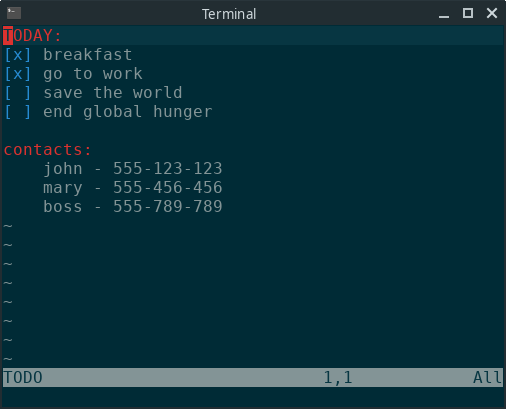

# vim-todo-color

I like to keep a file called "TODO" on my home folder as my scratchpad. This is not a plugin to imitate Emacs' Org Mode, this plugin is just to highlight my personal "TODO" file.

## Rules

There are only 2 kinds of text that are highlighted:

1. Colon at the end of the line.
2. Square brackets with 1 char in it.

## Installation

[vim-plug](https://github.com/junegunn/vim-plug)

1. Add the following configuration to your `.vimrc`

`Plug 'AffanIndo/vim-todo-color'`

2. Install with :PlugInstall
